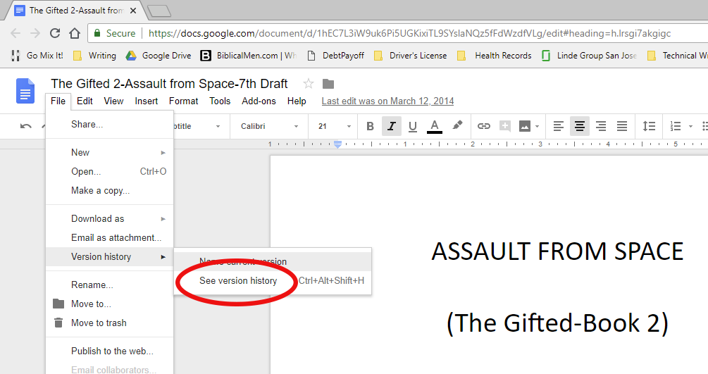
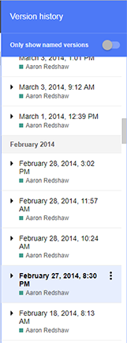
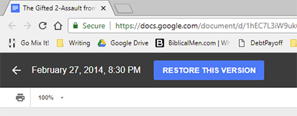
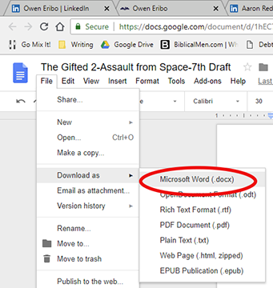
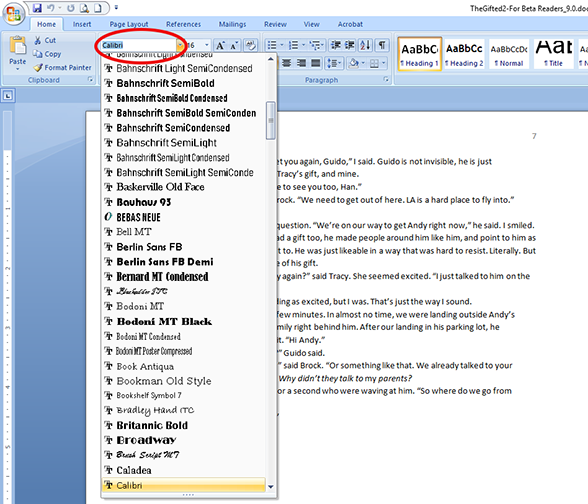
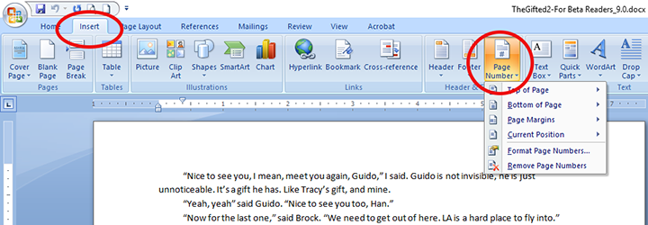
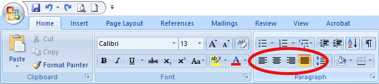
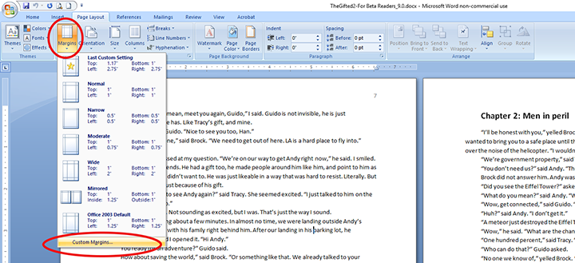
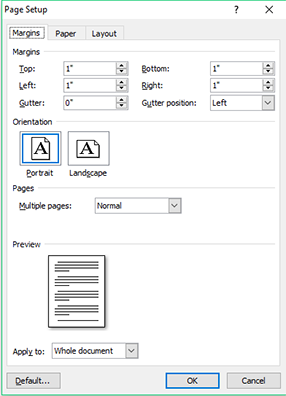
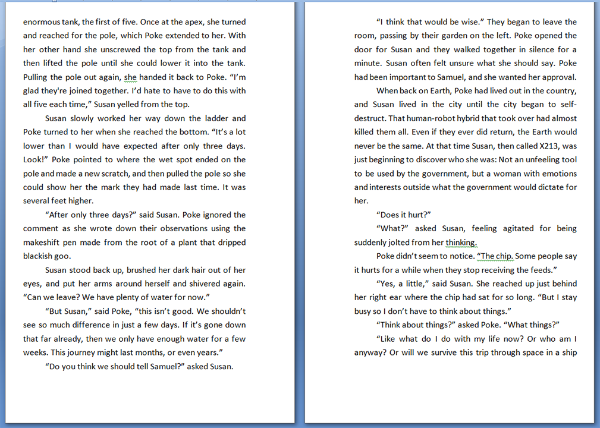

Skills demonstrated: Software documentation, screenshots, HTML, publishing, explaining step-by-step procedures, web development
Tools used: Google Docs, Microsoft Word, Photoshop, Adobe Acrobat, CMS (content management system), WordPress

[Read as a PDF](uploads/A-Self-Publishing-Guide-Tools-Used-pdf.pdf)

# Google Docs

I use Google Docs for the bulk of my drafting and revision. Some reasons for this are:

* Google Docs saves your document every few seconds, so I do not have to worry about hitting save often or making sure I have auto-save on in Word.

* Google Docs can be accessed from anywhere with an Internet connection.

* Google Docs has a version history feature which means I can go back to any time in my writing or revision process and revert to what I wrote in the past. Or just cut from a past version and paste into the present.

This last feature is the overwhelming reason I have found Google Docs invaluable. Figure 1 shows you how you can access this feature.

*Figure 1*

When you select “See version history,” Google Docs will list the times and dates your document was backed up. Click on any of these saved files and you will see the document as it was at that time. If you want to restore your document back to that version, simply click “Restore This Version.”  Your document will be restored.

*Figure 2-Version History*

*Figure 3-Restore*

This feature alone has saved me from disaster more than once. On my first book, The Gifted, I had written a scene I was particularly proud of. Yet the next day I deleted it, realizing it didn’t fit with the rest of the story. When I couldn’t get it out of my head I came up with a brilliant way to put it back into the story. The only problem was I had already deleted it. I used the version history and found a time when I had the scene in the book, but I had made other additions and corrections since writing the scene. Rather than restore it, and losing all the work I had done, I copied the scene into another text editor and then pasted it back into the story. It is still one of my favorite parts of the book.

Note: For the remainder of this guide, I will assume you plan to publish a physical print version of your book.

Now that your revisions are complete, it is time to download your book in Microsoft Word format. You can do this in Google Docs by clicking **File->Download as->Microsoft Word (.docx)**.

*Figure 4-Download as Microsoft Word Doc*

## Microsoft Word

While Google Docs has some advantages for first draft and revisions, you will eventually be ready to format your final version. Google Docs does not have the rubust formatting features available in Microsoft Word. Open the document you just downloaded using Microsoft Word.

When you first open Microsoft Word, the Style Gallery is that set of squares at the top right half of the screen which says things like “Normal,” “Heading 1,” “Heading 2,” “Title,” and “Subtitle.” By default, all of your text should be in the “Normal” style. You will use the Styles Gallery to make changes quickly. Find your first chapter title and then select “Heading 1” from the Style Gallery. Do the same for each chapter after that, so that all of your titles have the style “Heading 1.”

*Figure 5-Style Gallery*

Go back to one of your chapter titles and choose a font you like. You will see your selections at the top left of Microsoft Word (See Figure 6). You can also choose the size of the font to the right of the font selection.

*Figure 6-Fonts*

Once you have the chapter title with the look you want, keep it highlighted and go to the Style Gallery where you will right click on “Heading 1.” Choose  “Update Heading 1 to Match Selection” (see Figure 7). Every chapter title in your book will now have the same look as the one you just modified.

*Figure 7-Update Heading 1 to Match Selection*

Next, highlight a piece of a body paragraph and pick the font and size you want. While it is still highlighted, right click on “Normal,” in the Style Gallery and select “Update Normal to Match Selection.” Now all of the body of your book will change to look like that highlighted text. This is a great way to make changes in the formatting of your book and will save you hours of time.

## Page Numbers

To add page numbers go to **Insert->Page Number**. You will have several options to choose from. Pick the number style you want for your page numbers. You may experiment with these to find what works best for your book.

*Figure 8-Insert Page Numbers*

## Alignment of Text

Most books have text aligned so that they are justified. This means the text is spread out on each line in such a way that it lines up on the right and left side of the page simultaneously. See alignment examples below.

*Figure 9*

Make your alignment choice in the paragraph section of your toolbar (**Home->Paragraph**).

*Figure 10-Aligning Text*

## Page Dimensions

You will modify the dimensions of your book just before you are ready to publish it. Select Page Layout->Size  and choose the dimensions (Figure 11). You will likely want to choose “More Paper Sizes” at the bottom where you can type in a custom width and height. Once you are done, click OK at the bottom. One series of books I wrote were 5.5”x8.5”. My second series was 5”x8”.

*Figure 11-Page Dimensions*

## Modifying Page Layout

Since this is to be a printed book, you must give it the correct margins. This is trickier than you might think because on a printed book there is extra space given on the inside where the page connects to the binding. To do this, go to **Page Layout->Margins** (see Figure 12). At the bottom, select “Custom Margins.”

*Figure 12-Margins*

By default you should see something like Figure 13. Where it says “Multiple pages,” click on the drop-down menu and pick “Mirror margins,” then experiment with margins for the look you like. You can see what I did for one of my novels in Figure 14. ***Remember, the inside margins must be larger than the outside for this to work***.

*Figure 13-Default Margins*

*Figure 14-For Book Publishing*

When you are done, your pages should have margins like in Figure 15.

*Figure 15-Mirror Margins*

These two tools, Google Docs and Microsoft Word, are the two I use most when writing novels. There are many other tools I use as well for the conversion to e-book format and for book cover graphics, but if you get this far in your writing, you are almost there. Give yourself a pat on the back. Not many people can say they have written a novel!

[Read as a PDF](uploads/A-Self-Publishing-Guide-Tools-Used-pdf.pdf)